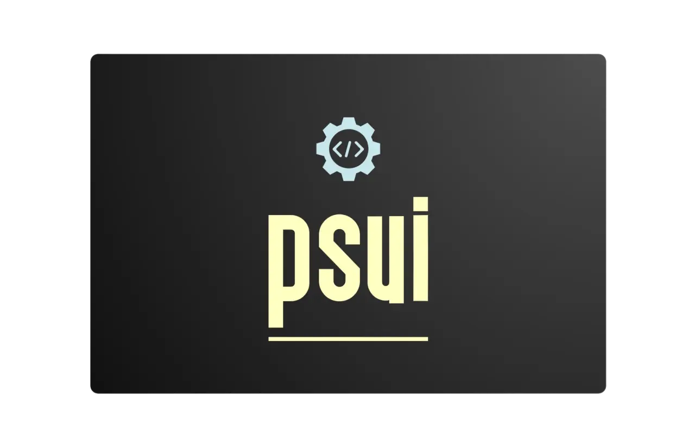

<h1 align="center">
  
</h1>

[](https://www.npmjs.com/package/@x7ddf74479jn5/psui)
[](https://bundlephobia.com/package/@x7ddf74479jn5/psui)
[](https://github.com/x7ddf74479jn5/psui/actions/workflows/storybook.yaml)

完全なドキュメントは、[Docs ⋅ PSUI](https://x7ddf74479jn5.github.io/psui/?path=/docs/getting-started-introduction--docs)でご覧ください。

## Features

- Radix Primitivesを使用した、アクセシビリティ完全なコンポーネントです。
- ButtonやInputなど、Radix以外のコンポーネントも含まれています。
- コンポーネントは、あらかじめスタイルが設定されています。スタイルはTailwindで簡単に上書きできます（PSUIはtw-mergeを使用しています）。
- セマンティックカラーシステムを内蔵しています。すべてのプロジェクトで同じセマンティックカラーを使用できます。
- Tailwindプラグインで、tailwind.config.jsをすっきりとした状態に保つことができます。
- Tree-shakable。バンドルサイズを気にすることなく、名前付きインポートを使用できます！

## Installation

もっと知りたい場合は公式ドキュメントを参照してください。

[Getting Started / Introduction \- Docs ⋅ PSUI](https://x7ddf74479jn5.github.io/psui/?path=/docs/getting-started-introduction--docs)

1. `pnpm add @x7ddf74479jn5/psui`と`pnpm add -D @x7ddf74479jn5/tw-plugin-psui`を実行します。
2. `tailwind.config.js`を修正し、インクルードします：
   - `"./node_modules/@x7ddf74479jn5/psui/dist/**/*.{js,mjs}"`を`content`配列の中へ
   - `require("@x7ddf74479jn5/tw-plugin-psui")`を`plugins`配列の中へ

```js
module.exports = {
  content: [
    "./pages/**/*.{js,ts,jsx,tsx,md,mdx}",
    "./components/**/*.{js,ts,jsx,tsx}",
    "./node_modules/@x7ddf74479jn5/psui/dist/**/*.{js,mjs}", // この行は重要です！これを入れないと、PSUIのスタイルがパージされます
    ,
  ],
  plugins: [
    require("@x7ddf74479jn5/tw-plugin-psui"), // 重要！これにより、CSS変数を消費するようにtailwindテーマを拡張します。
  ],
};
```

3. グローバルcssファイルを編集します。

プリセットテーマ *(default, bubblegum, gunmetal)* を使う場合は下記のようにインポートします。

```css
@import url("@x7ddf74479jn5/psui/dist/themes/default.css");

@tailwind base;
@tailwind components;
@tailwind utilities;
```

自分でテーマを作成する場合は[Concepts/Colors](https://x7ddf74479jn5.github.io/psui/?path=/docs/concepts-colors--docs)を参考にしてください。
